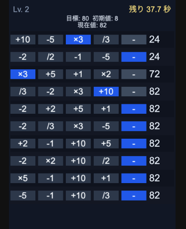

# Calc Rush

計算しろ、間に合わせろ! 制限時間つき演算パズルゲーム!!

## どんなゲーム?

- 全手の選択肢（各手4候補 + スキップ）を最初からまとめて編集して目標値に合わせる
- 制限時間は1プレイ全体で60秒
- 途中結果で目標値に一致した時点で即時クリア（後続の手は自動スキップ）
- ゲームオーバー後は「最初から」または「続きから」を選べる

## 操作方法

- 任意の手の演算ボタンをクリック: その手の選択を変更
- 各手のスキップをクリック: その手を未適用にする
- 「確認」ボタン: 結果を確認
- クリア後: 「次のレベルへ」
- 敗北後: 「最初から」/「続きから」

## 演算プール

+1 / +2 / +5 / +10 / −1 / −2 / −5 / ×2 / ×3 / ×5 / ÷2 / ÷3

- 除算は端数切り捨て（例: 7 ÷ 2 = 3）
- 目標値を超えても続行（減算・除算で戻せる）
- 各手は 4 択 + スキップで構成

## 難易度

| レベル | 初期値範囲 | 目標値範囲 | 最大手数 |
|---|---|---|---|
| 1 | 1〜5 | 20〜50 | 12 |
| 2 | 1〜10 | 50〜100 | 10 |
| 3 | 1〜15 | 80〜150 | 9 |
| 4 | 1〜20 | 100〜200 | 8 |
| 5以降 | 1〜20 | 150〜300 | 8（固定） |

## こんな人向け

- 短時間で遊べる頭の体操を探している人
- 計算ルートを先読みして最適手を考えるのが好きな人
- 失敗したとき「どうすれば解けたのか」を知りたい人

## 開発メモ

- 依存インストール: npm install
- 開発サーバー: npm run dev
- ビルド: npm run build
- テスト: npm run test

詳細仕様は docs/spec.md を参照してください。
