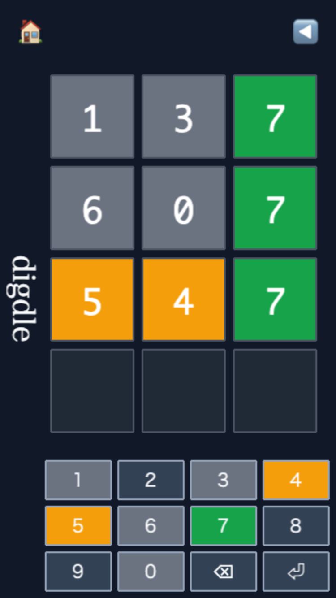

# digdle

素数を当てろ! wordle風・素数当てゲーム登場!!

## どんなゲーム?

- お題は 2〜6 桁の素数
- 予想した素数を入れると、色ヒントが返ってくる
- ヒントを頼りに正解をしぼっていく
- 制限回数内に当てたらクリア!

### 色ヒント

- 緑: 数字も場所も正解
- 黄: 数字はあるけど場所違い
- 灰: その数字は使われていない（重複ルールあり）

## 操作方法

- 数字キー: 入力
- Backspace: 1 文字削除
- Enter: 判定
- 画面上のキーボードでも遊べる

## モード

- ノーマル: まずはこっちでOK
- ハード: 出たヒントを次の手でもちゃんと守るモード

## ルール

- 入力値は N 桁の素数のみ有効
- 桁違い/非素数は無効入力（回数は減らない）
- 試行回数は桁数に応じて変化
  - 2 桁: 3 回
  - 3 桁: 4 回
  - 4 桁: 5 回
  - 5 桁: 6 回
  - 6 桁: 7 回

## コツ

- 最初は数字がバラけた素数で情報を集める
- 黄は「場所入れ替えヒント」として使う
- ハードは整合性チェックが命

## 開発メモ

- 依存インストール: npm install
- 開発サーバー: npm run dev
- ビルド: npm run build
- テスト: npm run test

詳細仕様は docs/spec.md を参照してください。
