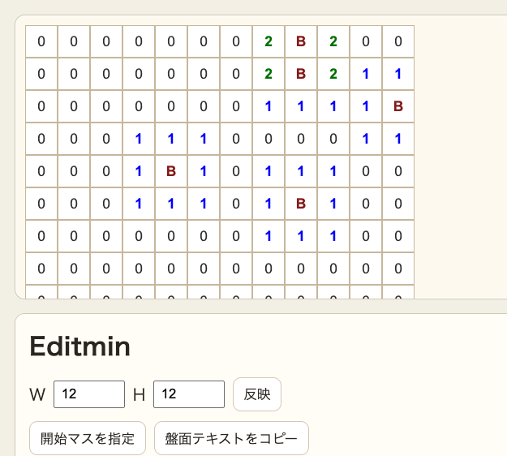

# editmin

作ってニヤけろ! マインスイーパー問題メーカー、爆誕!!

## どんなツール?

- マスをポチポチして地雷配置を作る
- 数字は自動で再計算
- 難易度と「論理で解けるか」をその場でチェック
- 作問と調整をテンポよく回せる

## 操作

- セルを左クリック: 爆弾の配置/解除
- 幅・高さ入力: 盤面サイズ変更
- 開始マス指定: 指定モードでセルを選択
- 盤面が大きいとき: 盤面エリアをスクロールして移動

## ルール

- 開始マスとその周囲 8 マスには爆弾を置けない
- 数字は隣接爆弾数に応じて常時更新
- 制約違反の設定は拒否される

## 判定

- 難易度は Easy / Normal / Hard / Expert
- スコア根拠も表示されるので調整しやすい
- 仮定なしで解ける盤面かどうかも確認できる

## こんな人向け

- マインスイーパー問題を作成したい人
- 作問の難易度を定量的に見たい人
- 推理で解ける問題だけを公開したい人

## 開発メモ

- 依存インストール: npm install
- 開発サーバー: npm run dev
- ビルド: npm run build
- テスト: npm run test

詳細仕様は docs/spec.md を参照してください。
