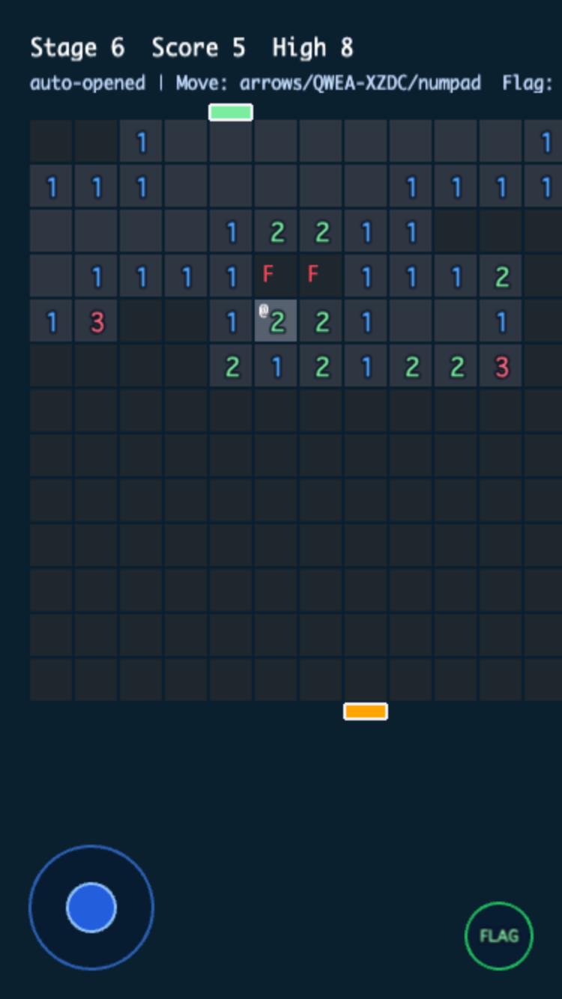

# Minefield Rogue

踏むな、読み切れ! 推理で抜ける地雷原ローグライク!!

## どんなゲーム?

- 数字ヒントを読んで地雷位置を推理
- 8方向移動でスタートからゴールを目指す
- 合ってるフラグなら地雷マスも通過できる
- ミスったら即終了。緊張感高め

## 特徴

- 全ステージが推理だけで解けるように生成
- 運任せの当て推量を前提にしない設計
- 進むほど盤面サイズと難易度が上昇
- 死亡すると最初からやり直しのパーマデス

## 操作方法

- 移動: 矢印キー / テンキー 1-9（5除く）/ QWEA + XZDC
- フラグ: Shift + 方向キー（隣接マスへ設置・解除）
- コード操作: S またはテンキー 5
  - 条件がそろうと自動展開や自動フラグ補助が動く

## ルール

- 爆弾をフラグなしで踏むと即死
- 非爆弾にフラグを立てて踏んでも即死
- 数字と矛盾しないルート作りがカギ

## こんな人向け

- マインスイーパーの論理推理が好きな人
- 緊張感のある1ミス即終了ゲームが好きな人
- 反射より判断を楽しみたい人

## 開発メモ

- 依存インストール: npm install
- 開発サーバー: npm run dev
- ビルド: npm run build
- テスト: npm run test

詳細仕様は docs/spec.md を参照してください。
