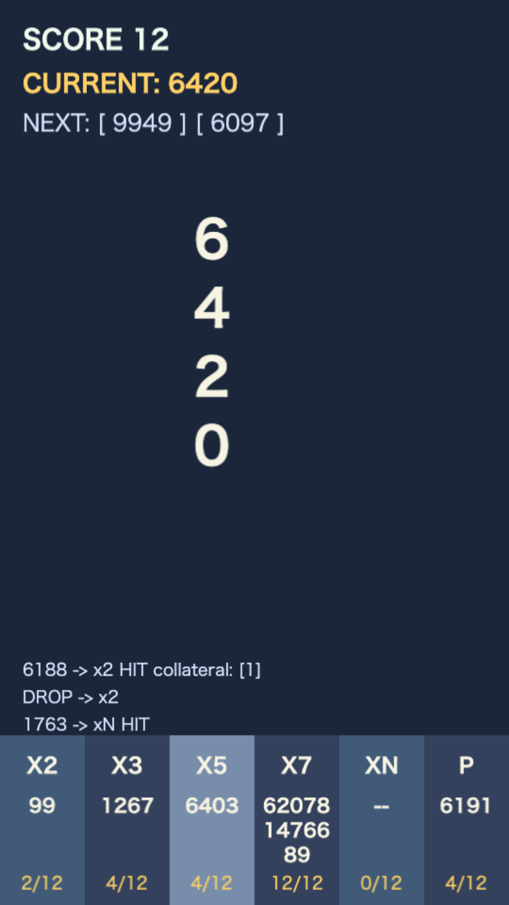

# primtris

割って選んで、詰まる前にさばけ! 素因数ボックス仕分けパズル!!

## どんなゲーム?

- 落ちてくる整数を素因数ルールでボックスに仕分け
- 入れ先をミスると数字が桁ごとにボックスへ残る
- ボックス容量オーバーでゲームオーバー
- ハイスピード計算というより、落ち着いた判断型パズル

## ルール

- タイトル画面で桁数を選んでスタート
- 素数は P が正解
- 合成数は 2 / 3 / 5 / 7 を因数に持つ対応ボックスが正解
- 2 / 3 / 5 / 7 のいずれも因数に持たない合成数は xN が正解
- 正解時は、投入数字そのものは残らず、同じボックス内の同じ数字を新しい順に 1 対 1 で消去
- 不正解時は数字が桁ごとに蓄積

## 操作方法

- 数字は上から落ちてきて中央で停止
- 左右キーまたはドラッグで投入先を選択
- 指を離す、または Down / Enter で投入確定

## スコア

- 投入完了した数の合計がスコア
- 正解でも不正解でも投入が完了すれば +1

## こんな人向け

- 計算ドリルより、判断型のパズルが好きな人
- 素数や素因数分解をゲーム感覚で触りたい人
- 短時間で 1 プレイずつ区切って遊びたい人
- 落ち着いて次の一手を選ぶゲームが好きな人

## 開発メモ

- 依存インストール: npm install
- 開発サーバー: npm run dev
- lint: npm run lint
- テスト: npm run test
- カバレッジ: npm run test:coverage
- ビルド: npm run build

詳細仕様は docs/spec.md を参照してください。
