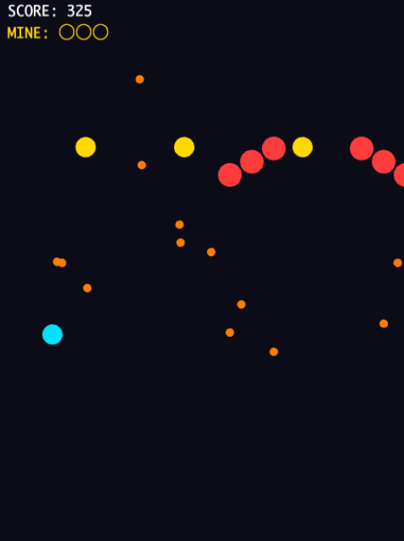

# shoot1

避けて、置いて、まとめて吹っ飛ばせ! 地雷つき弾幕サバイバル!!

## どんなゲーム?

- 弾幕をひたすら避けて生き残る
- 地雷を置いて敵と弾をまとめて爆破
- 時間がたつほど密度アップ
- 被弾か自爆でゲームオーバー

## 操作方法

### PC

- 移動: 矢印キー または WASD
- 地雷設置: Space または Z
- リスタート: ゲームオーバー時に R

### スマートフォン/タブレット

- 左下の仮想スティック: 移動
- 右下の BOMB ボタン: 地雷設置
- ゲームオーバー画面タップ: リスタート

## 地雷のポイント

- 初期所持は 3 発
- 設置後 0.5 秒は自機との接触判定を無効化
- 約 10 秒経過でも自動爆発
- 爆風範囲内の敵機と敵弾を同時に消せる
- 置きっぱなしは自分が巻き込まれやすいので注意

## スコア

- 生存時間をスコア化
- できるだけ長く生き残ることが目標

## こんな人向け

- 短時間で遊べるシューティングを探している人
- 回避と設置の判断を楽しみたい人
- タッチ操作で弾幕ゲームを遊びたい人

## 開発メモ

- 依存インストール: npm install
- 開発サーバー: npm run dev
- ビルド: npm run build
- テスト: npm run test

詳細仕様は docs/spec.md を参照してください。
